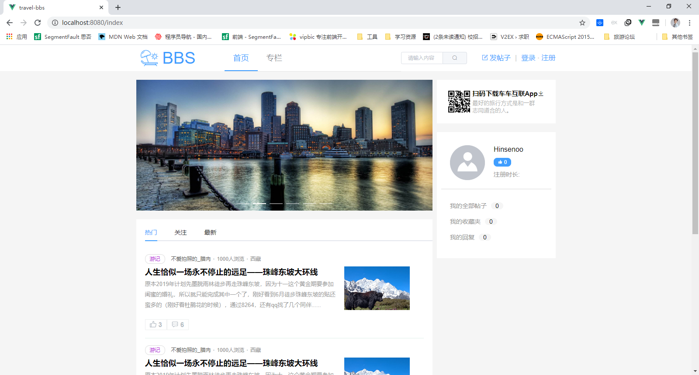
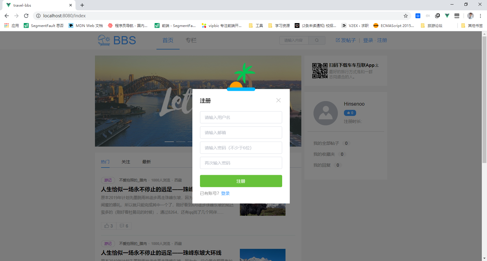
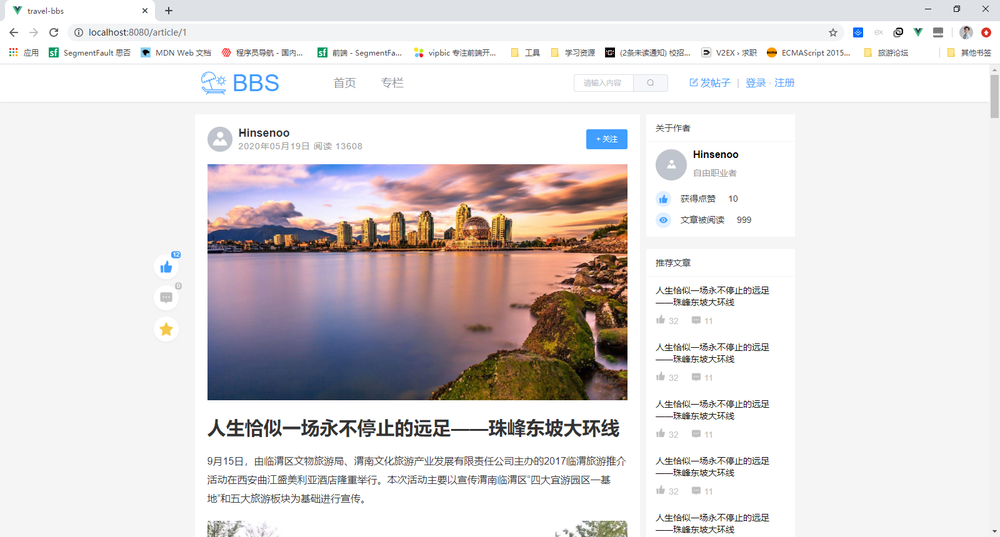
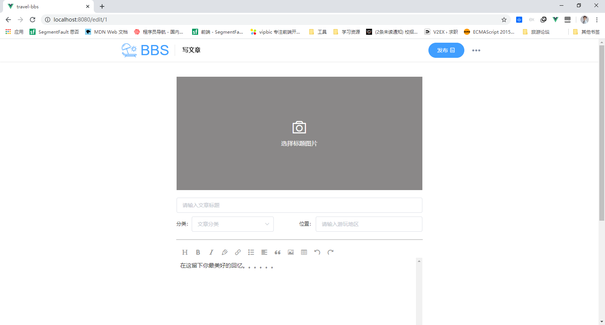

# travel-bbs 旅游论坛

- 技术栈：Vue + Vue-router + Vuex + ElementUI + Axios + scss

- 

- 项目地址：[http://bbs.hinsenoo.top](http://bbs.hinsenoo.top/)  

- 项目介绍：基于 Vue 全家桶及 ElementUI 组件库，实现了论坛的基本功能，包括基本用户功能及文章编写、点赞、评论等功能。

- 主要工作：

  1. 抽取封装通用组件，弹出层组件。
  2. 使用富文本编辑器开发了文章编辑页面 
  3.  使用 axios 库与后端数据交互，并且进行接口统一错误拦截。
  4. 使用 nginx 反向代理解决跨域问题 5. 使用图片懒加载，滚动加载获取后端数据，异步组件，Element UI库按需引入等进行性能优化

- 项目难点以及解决：

  - Vue 无法检测数组和对象变化，使用 Vue.set 来添加响应式属性
  - 后端无法接受处理带双引号的富文本，使用 Base64 转义来处理富文本数据

  


### 项目安装

```
npm install
```

### 编译并且运行项目
```
npm run serve
```

### 项目打包
```
npm run build
```

### 修复项目
```
npm run lint
```


### 项目截图








